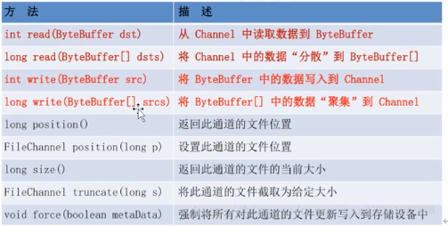

### NIO
#### NIO的做成
1. Channel
    * 通道，和IO中的stream 是差不多一个等级的，只不过Stream是单向的，channel是双向的，既可以用来进行读操作
又可以进行写操作
    * Channel 中的主要实现有： FileChannel(文件),DatagramChannel(UDP),SocketChannel(TCP client),和ServerSocketChannel(TCP server).
2. Buffers
   * 缓冲区
   * Buffer 中的实现有ByteBuffer,CharBuffer,DoubleBuffer,FloatBuffer,InBuffer,LongBuffer,ShortBuffer
3. Selectors
   * 选择器： 运行单线程处理多个Channel，如果应用打开了多个通道，但是每个连接的连接都很低，使用Selector就会很方便，
例如，一个聊天服务器中， 要使用Selector，得向Selector注册Channel，调用Select()方法，这个方法会一直阻塞到某个
注册的通道有事件就绪，一旦这个方法返回，线程就可以处理这些事件，事件的例子有如果新的连接进来，数据接收等。
4. 其他组件：Pipe和FileLock等，是上面三个组件使用的工具类
#### Channel
* Channel 是一个通道，可以通过他读取数据，就像水管一样，网络数据通过Channel读取或写入，通道与流不同之处
在于通道是是双向的， 流只是在一个方向上移动， 一个流必须是InputStream，或者OutputStream的子类， 而通道
可以用于读写或者同时用于读写， 因为Channel是全双工的，所以他可以比流更好的映射到底层操作系统的api。
  
* NIO中通过channel封装了对数据源的操作， 通过channel我们可以操作数据源， 但是又不必关心数据源的具体物理
结构，这个数据源可能是多种的， 比如可以是文件，也可以是网络Socket，在大多数应用汇总给你，channel与文件描述
符或者socket是一一对应的，channel用于在字节缓冲区和位于通道另一侧的实体之间有效地址传输数据。

* 与缓冲区不同， 通道API主要是由接口指定， 不同的操作系统上，操作系统通道实现会有别致的差异，所以通道api仅仅
描述了可以做什么，因此很自然的，通道实现经常使用操作系统的本地代码，通道接口允许以一种受控制切可以一致的方式来实现
底层的I/O服务
  
* Channel是一个对象，可以读取和写入数据，NIO和BIO比较
    1. 通道就像是流， 所有数据通过Buffer对象来处理， 永远不会将字节写入到通道中，相反将数据写入到包含一个
或者多个自己的缓冲区，同样，不会直接在通道中读取字节，而是将数据从通道中读入到缓冲区，在从缓冲区读入这个字节。
    2.  NIO是从通道中读取数据，有可以写数据到通道， 但是流是单向的
    3. 通道可以异步的读写
    4. 通道中的数据总是先读写到一个Buffer 

* FileChannel 
    * 基本API
        * 
    * FileChannelReadDemo & FileChannelWriteDemo
        1. 创建FileChannel
           * 打开FileChannel
           * 在使用FileChannel之前，必须先打开它，但是，我们无法直接打开一个
              FileChannel，需要难过通过InputStream,OutputStream 后 RandomAccessFile
              获取一个FileChannel实例

        2. 创建Buffer
            * 调用多个Read方法之一，从FileChannel中读取数据：
                1. 分配一饿buffer， 从FileChannel中读取数据放入到Buffer中，然后调用FileChannel.read()
方法，该方法将数据从FileChannel读取到Buffer中， read()方法返回的int值表示有多少个字节被读取到了Buffer中，
如果返回-1, 表示读到了文件的末尾。
    
        3. 读取数据到Buffer
        ``` java 
        // 创建FileChannel
        RandomAccessFile file = new RandomAccessFile("nio-demo-dir/01.txt","rw");
        FileChannel inChannel= file.getChannel();
        // 创建Buffer
        ByteBuffer byteBuffer = ByteBuffer.allocate(128);
        // 读取buffer
        int bytesRead = inChannel.read(byteBuffer);
        while(bytesRead != -1){
            System.out.println("读取了：" + bytesRead);
            byteBuffer.flip();
            while(byteBuffer.hasRemaining()){
                System.out.println((char) byteBuffer.get());

            }
            byteBuffer.clear();
            bytesRead = inChannel.read(byteBuffer);
        }

        file.close();
        System.out.println("结束了");// 创建FileChannel
        RandomAccessFile file = new RandomAccessFile("nio-demo-dir/01.txt","rw");
        FileChannel inChannel= file.getChannel();
        // 创建Buffer
        ByteBuffer byteBuffer = ByteBuffer.allocate(128);
        // 读取buffer
        int bytesRead = inChannel.read(byteBuffer);
        while(bytesRead != -1){
            System.out.println("读取了：" + bytesRead);
            byteBuffer.flip();
            while(byteBuffer.hasRemaining()){
                System.out.println((char) byteBuffer.get());

            }
            byteBuffer.clear();
            bytesRead = inChannel.read(byteBuffer);
        }

        file.close();
        System.out.println("结束了");
        ```
        4. 向FileChannel中写数据
        ``` java 
        RandomAccessFile accessFile = new RandomAccessFile("nio-demo-dir/01.txt","rw");
        FileChannel fileChannel = accessFile.getChannel();
        String data = "New String to write to file...." + System.currentTimeMillis();

        ByteBuffer byteBuffer = ByteBuffer.allocate(1024);
        byte[] bytes = data.getBytes(StandardCharsets.UTF_8);
        byteBuffer.put(bytes);
        byteBuffer.flip();
        while (byteBuffer.hasRemaining()){
            fileChannel.write(byteBuffer);
        }

        fileChannel.close();
      
        ```
        5. 使用FileChannel 必须调用`close` 方法
        6. FileChannel的position方法
            * 有时可能需要在FileChannel的某个特定位置进行数据的读写操作，可以通过`position`方法获取FileChannel的当前位置。也可以通过调用position(long pos)
方法设置FileChannel的当前位置。
            ``` Java
                long pos = channel.position();
                channel.position(pos + 123);
            ```
            * 如果将位置设置在文件的结束位置之后，然后试图读取通道中的数据，读方法将返回-1 （文件结束标志）
            * 如果将位置设置到文件结束位置之后，然后试图向通道中写数据，文件将撑大到当前位置并写入数据，可能导致文件空洞，磁盘物理文件写入的数据间 有空隙。 
        7. FileChannel的size() 方法
            * FileChannel实例的size()方法将返回该实例所关联的文件的大小。如：
            ``` Java
            long fileSize = channel.size();
            ``` 
        8. FileChannel 的truncate方法
            * 可以截取一个文件，文件将指长度后面的部分删除`fileChannel.truncate(1024);
        9. FileChannel的force方法
            * 将通道里尚未写到磁盘的数据强制写到磁盘上。处于性能考虑，操作系统会将数据缓存在内存中，所以无法保证写入到FileChannel里面的数据
  一定会写入到磁盘尚，要保证这一点需要调用force方法。（ flush？）
            * force方法有一个boolean类型的参数，是否要将文件的元信息写到硬盘上（权限信息）
        10. FileChannel的transferFrom和transferTo方法
            *  通道之间的数据传输
                * 如果两个通道之间有一个FileChannel，那可以将数据从一个channel 传到另一个channel
                * transferFrom 可以将数据源通道传输到FileChannel中
                ``` java 
                  RandomAccessFile file = new RandomAccessFile("netty-study/nio-demo-dir/01.txt", "rw");
                  FileChannel from = file.getChannel();
                  file = new RandomAccessFile("netty-study/nio-demo-dir/02.txt", "rw");
                  FileChannel to = file.getChannel();
            
                  long position = 0;
                  long count = from.position();
            
                  to.transferFrom(from,position,count);
                  to.close();
                  from.close();
                  System.out.println("over");
                ```
                * transferTo 讲述句传输到其他的FileChannel中 
                ``` java 
                  RandomAccessFile file = new RandomAccessFile("nio-demo-dir/01.txt", "rw");
                  FileChannel from = file.getChannel();
                  file = new RandomAccessFile("nio-demo-dir/03.txt", "rw");
                  FileChannel to = file.getChannel();
            
                  long position = 0;
                  long count = from.size();
                  System.out.println("size:" + count + " position:" + from.position());
                  from.transferTo( position,count,to);
                  to.close();
                  from.close();
                  System.out.println("over");
                ```
* Socket通道
    * Socket通道 可以运行非阻塞模式并且是可选择的， 可以激活大程序（如网络服务器和中间组件）巨大的伸缩性和灵活性，可以不用
为每个socket连接使用一个线程的必要了， 也避免了管理大连线程所需要的上下文交换开销。记住新的NIO类，一个或几个线程可以管理成百
上千个获得的Socket连接了，并且只有很少的甚至可能没有性能损失。所有的Socket通道类（DatagramChannel，SocketChannel，
和ServerSocketChannel）都继承了位于java.nio.channels.spi包中的AbstractSelectableChannel。这意味着我们可以用一个
Selector对象来执行socket通道的就绪选择（readiness selection）。
    * DatagramChannel和SocketChannel实现定义读和写功能的接口而ServerSocketChannel不实现。ServerSocketChannel负责监听传入的
连接和创建新的SocketChannel对象，本身从不传输数据。
    * socket与Socket通道之间的关系： 
        1. 通道是连接IO服务的导管并与该服务交互的方法 
        2.` socket： 他不会再次实现与之对应的Socket通道类的Socket协议api。`而`java.net中已经存在的socket通道能够被大多数协议操作重复使用`
        3. 全部socket通道类，在被实例化时，都会创建一个对等的Socket对象。可以通过socket（）方法获取
        4. Socket类，ServerSocket类，DataagramSocket类可通过getChannel方法获得通道
    * Socket通道可以被设置为非阻塞模式，要依赖所有socke通道类的父类SelectableChannel的configureBlocking
        * 非阻塞模式通常被认为是服务端使用的，它可以是同时管理多个socket通道变得容易，但是客户端也可以使用非阻塞模式的socket通道。例如借助非阻塞sokeet通道
GUI程序可以请求并且同时维护一个或多个服务器上的会话，在很多成续上，非阻塞模式都是非常有用的。
        * 偶尔，也需要防止socket通道的阻塞模式被更改，Api有一个blockLock方法，该方法会返回一个透明的对象引用，返回的对象是修改通道的阻塞模式内部使用的，只有用于这个对象锁的线程才能修改通道的阻塞模式。
* ServerSocketChannel
    * SeverSocketChannel是一个基于通道的socket监听器，与ServerSocket执行相同的任务，它增加了通道的语义，并且能够在非阻塞的模式下运行。
    * ServerSocketChannel 没有bind方法，因此有必要取出对等的socket，并使用它来绑定一个端口已开始监听连接。所以也是使用对等的ServerSocketApi来根据他的需要
设置它的socket选项。
    * 与ServerSocket一样，ServerSocketChannel也有accept()方法，一旦创建了一个ServerSocketChannel，并用对等的socket绑定了它，就可以在其中一个上调用accept（），
如果在ServerSocket上调用accept方法，那么他同其他的ServerSocket表现的行为是一样的，总是阻塞并返回一个  Socket对象。***如果选择在一个ServerSocketChannel上
调用accept方法，会返回一个SocketChannel类型的对象，返回的对象能够在非阻塞的模式下运行。***
    * ServerSocketChannel以非阻塞的方式进行调用的情况下，没有传入连接在等待的情况下，调用一个accept方法
会立刻返回一个null，正是这种检查连接而不是阻塞的能力实现可了可伸缩性，并降低了复杂性。可选择行也得到了实现。
    * ``` java
      //端口号设置
        int port = 8888;
        //buffer
        ByteBuffer buffer = ByteBuffer.wrap("Hello World".getBytes(StandardCharsets.UTF_8));
        //ServerSocketChannel
        ServerSocketChannel  serverSocketChannel = ServerSocketChannel.open();
        serverSocketChannel.socket().bind(new InetSocketAddress(port ));
        //设置非阻塞模式
        serverSocketChannel.configureBlocking(false);
        // 无限循环，监听是不是有新的连接传入
        while(true){
            SocketChannel socketChannel = serverSocketChannel.accept();

            if(socketChannel == null){
                System.out.println("have no socket connect to ser ver");
                Thread.sleep(2000);
            }else {
                System.out.println("Incommint from :" + socketChannel.socket().getRemoteSocketAddress() );
                buffer.rewind(); // 指针指向了0
                socketChannel.write( buffer);
                socketChannel.close();
            }
        }
      ```
* SocketChannel 
    * 一个连接到TCP网络套接字的通道
    * SocketChannel是一种面向流连接的sockets套接字的可选择通道
    * 用途：
        1. 用来连接socket的套接字
        2. 用来处理网络I/O的通道
        3. 基于TCP的连接传输
        4. 实现了可选择通道，可以被多路复用
    * SocketChannel的特征
        1. 对于已经存在的socket 不能创建SocketChannel
        2. SocketChannel的open方法创建的Channel并没有进行网络级联，要是用Connect接口连接到指定地址。
        3. 为进行连接的SocketChannel接口执行I/O操作的时候会抛出  `NotYetConnectedException`
        4. SocketChannel支持两种I/O模式,阻塞模式和非阻塞模式
        5. SocketChannel支持异步关闭，如果SocketChannel在一个线程上read阻塞，另外一个线程调用`shutDownInput`,
则阻塞线程将返回-1，表示没有读取任何数据。如果SocketChannel在一个线程上Write阻塞，另外一个线程调用`shutDownWrite`,
则阻写塞线程将抛出`AsynchronousCloseExcepiotn`
        6.  SocketChannel 支持设定参数
            1. SO_SNDBUF 套接字发送缓冲区大小。
            2. SO_RCVBUF 套接字接收缓冲区大小
            3. SO_KEEPALIVE 保活连接
            4. O_REUSEADDR  复用地址
            5. SO_LINGER 有数据传输时延缓关闭Channel，只有子啊非阻塞模式下有用。
            6. TCP_NODELAY 禁止使用Nagle算法
    * 创建SocketChannel的两种方式
        1. ``` java
           //方式
           SocketChannel sc = SocketChanel.Open(new InetSocketAddress("www.baidu.com",80));
           ```

        2. ``` java
           //方式
           SocketChannel sc = SocketChanel.Open();
           sc.connect(new InetSocketAddress("www.baidu.com",80));
           ```
    * 连接校验
        1. SocketChannel.isOpen() 测试SocketChannel是否是Open状态
        2. SocketChannel.isConnected()  测试SocketChannel是否是连接状态
        3. SocketChannel.isConnectionPending() 测试SocketChannel是否正在进行连接
        4. SocketChannel.finishConnect() 校验正在进行套接字连接的SocketChannel是否已经完成了连接
    * 读写模式(阻塞还是非阻塞)
        1.  SocketChannel.configureBlocking(false); 
    * 读写
        1. ``` java
            SocketChannel sc = SocketChannel.open(new InetAddress("www.baidu.com",80));
            ByteBufer bf = ByteBuffer.allocate(128);
            sc.read(bf);
            sc.close();
            System.out.println("over")

           ```
* DatagramChannel
    * DatagramChannel 也有一个DatagramSocket，模拟包导向的（UDP/IP），DatagramChannel是无连接的，每个数据报都是一个自包含的实体，
拥有它自己的目的地址以及不依赖数据报的数据负载，与socket不同，Datagram可以发送单独的数据报给不同的数据地址，同样也可以接收来自任意地址的数据报。
    * 客户端
        ``` Java
        DatagramChannel client = DatagramChannel.open();
        InetSocketAddress address = new InetSocketAddress("localhost",10086);
        while (true) {
            // 发送数据
            ByteBuffer sendBuffer = ByteBuffer.wrap("发包".getBytes(StandardCharsets.UTF_8));
            client.send(sendBuffer, address);

            System.out.println("客户端发包");
            Thread.sleep(2000);
        }
        ```
    *  服务器端
        ``` java
        // 打开DatagramChannel
        DatagramChannel server = DatagramChannel.open();
        server.bind(new InetSocketAddress(10086));
        // 通过Receive 接收UDP的包
        ByteBuffer receiveBuffer = ByteBuffer.allocate(1024);
        while (true) {
            receiveBuffer.clear();
            SocketAddress address = server.receive(receiveBuffer);
            receiveBuffer.flip();
            if(address != null) {
                System.out.println(address.toString() );
                receiveBuffer.flip();
                System.out.println(Charset.forName("UTF-8").decode(receiveBuffer));
            }
        }
       
        ```
    * 连接： UDP不存在真正意义上的连接，这里的连接是只向特定的服务地址用Read或者Write接收发送数据包

* scatter(分散)/Gather（聚集）
    * scatter： 从channel中读取是指在读取操作时，将读取的数据放到多个buffer中，Channel将从Channel中读取数据分散到多 个buffer中
    * Gather是指： 写操作时，将多个Buffer中的数据写到同一个channel中，因此channel将多个Buffer中的数据聚集后发送到channel。
#### Buffer
* Buffer 的作用： Buffer用于和Channel进行交互，数据是从通道读入到缓冲区，从缓冲区写入到通道中。
* Buffer的本质： 可以写入数据，并从中读取数据的一块而内存。 这块儿内存包装成Nio的buffer对象，并提供了一组方法，用来方便的访问内存。
缓冲区实际上是一个容器对象。更直接的说就是一个数组，在NIO的库中，所有的数据都是缓冲区的处理。在读取数据时，直接将数据读取到缓冲区中，
而写入数据也是写入到缓冲区中的。任何访问NIO的数据都是将它放到缓冲区中，而在面向IO的系统中，所有数据都是直接写入到或者读取的stream中。 
* 在NIO中，所有的缓冲区类都是继承自Buffer，最长用的就是ByteBuffer，对于java 中的基本类型，基本都有一个具体的buffer类型与之对应，
* Buffer的基本用法
    1. 使用Buffer 读写数据一般下面四个步骤
        1. 写入数据到buffer
        2. 调用flip()方法
        3. 从buffer 中读取数据
        4. 调用Clear方法或者compact方法
    2. 当向buffer 写入数据的时候，buffer会记录写了多少数据，一旦要读取数据，需要通过flip()方法将buffer从写模式切换到读模式，在读模式下，可以
读取之前写入到buffer中的内容，一旦读完数据，就清空缓冲区，调用clear后者compact方法，clear方法会清空整个缓冲区。compact 方法会清空已经读的数据。
任何未读的数据都会移到缓冲区的起始处，新写入的数据将放到缓冲区未读数据的后面。 


